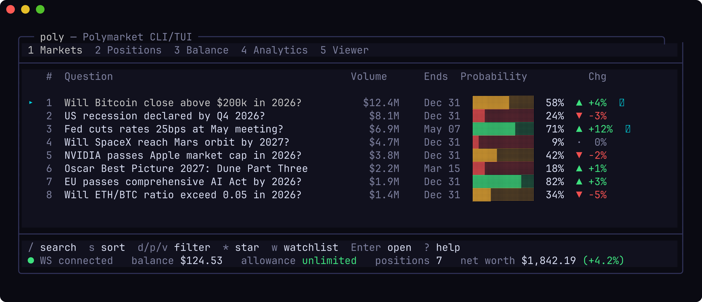

# poly

A CLI and TUI for trading on [Polymarket](https://polymarket.com). Search markets, place orders, manage positions, and track prediction accuracy — all from your terminal.

## Screenshots



*Static mock of the Markets tab. Re-generate with
`python3 docs/gen_screenshot.py | freeze ...` (see the script header).
For a live recording, `docs/demo.tape` is a
[vhs](https://github.com/charmbracelet/vhs) script you can run locally:
`vhs docs/demo.tape` → `docs/demo.gif`.*

## Quick Start

```bash
# Install from source (requires Rust toolchain)
cargo install --git https://gitlab.com/maxweilbuchner/poly-v2.git

# Or clone and build locally
git clone https://gitlab.com/maxweilbuchner/poly-v2.git
cd poly-v2 && cargo install --path .

# Interactive setup — walks you through credentials step by step
poly setup

# Or just launch the TUI (setup runs automatically on first launch)
poly
```

## Setup

`poly setup` prompts for each credential with instructions on how to obtain it:

| Credential | Required | How to get it |
|---|---|---|
| **Private Key** | Yes | Export from MetaMask: Account menu > Account details > Show private key |
| **API Key** | Yes | Run `poly derive-keys` or find in your Polymarket API settings |
| **API Secret** | Yes | Same as above |
| **API Passphrase** | Yes | Same as above |
| **Polygon RPC URL** | No | Free key from [Alchemy](https://alchemy.com) or [Infura](https://infura.io) — only needed for `poly balance` |
| **Funder Address** | No | Only if trading through a proxy wallet or Gnosis Safe |

Credentials are saved to `~/.poly/config.toml` (chmod 600). Environment variables and `.env` files take priority if present.

You can re-run setup at any time from the CLI (`poly setup`) or from within the TUI (press `q` then `s`).

## TUI

Running `poly` with no subcommand opens the interactive dashboard.

### Tabs

| Tab | Key | Description |
|---|---|---|
| Markets | `1` | Browse, search, filter, and star markets |
| Positions | `2` | View open positions and orders, close/cancel/redeem |
| Balance | `3` | Cash, allowance, positions, net worth summary + chart |
| Analytics | `4` | Prediction calibration curves, resolution stats, calibration matrix |
| Viewer | `5` | Browse any wallet's portfolio by address |

### Key Bindings

**Navigation**
- `1`–`5` switch tabs, `Tab` cycles tabs/panels
- `↑↓` / `jk` navigate lists, `Enter` opens detail
- `q` opens the menu, `?` opens help, `Esc` goes back, `Ctrl+C` force quits

**Markets**
- `/` search, `s` sort (volume/date/prob), `d` date filter, `p` probability filter, `v` volume filter
- `*` star/unstar, `w` watchlist-only, `e` export starred to JSON
- `r` refresh

**Market Detail**
- `←→` / `Tab` cycle outcomes, `t` sparkline interval (1d/1w)
- `b` buy, `s` sell, `c` copy condition ID

**Order Entry**
- `Tab` next field, `Space` cycle order type (GTC → FOK → IOC → Market)
- `m` fill max size (cash balance for buy, held shares for sell)
- `d` toggle dry-run, `Enter` submit, `Esc` cancel

**Positions**
- `b`/`s` buy more / sell, `x` close at market
- `c` cancel order, `C` cancel all orders
- `R` redeem resolved position, `A` redeem all redeemable

**Balance**
- `r` refresh balance

**Analytics**
- `p` pull market snapshot, `r` recompute analytics
- `s` collapse/expand status panel
- `t` cycle calibration time window (3h/6h/9h/12h)
- `w` toggle WLS/OLS regression
- `c` copy DB path, `o` open data folder

**Viewer**
- `/` enter address, `Enter` submit, `Esc` cancel
- `↑↓` / `jk` navigate positions, `Enter` open market detail
- `r` refresh

## CLI Commands

```bash
# Search & browse
poly search "Trump" --limit 10
poly market will-trump-win-2024
poly market 0x<condition-id> --book
poly top --limit 20 --category politics
poly book <token-id>

# Trade
poly buy <token-id> 10 0.65                # 10 shares at $0.65
poly buy <token-id> 10 --market            # market order (FOK at best ask)
poly sell <token-id> 10 0.90
poly buy <token-id> 10 0.65 --dry-run      # validate without submitting

# Manage
poly orders
poly positions
poly cancel <order-id>
poly cancel-all
poly cancel-market <condition-id>
poly balance
poly history --limit 20

# Export
poly export positions --output positions.csv
poly export orders

# Utilities
poly setup                                 # interactive credential wizard
poly doctor                                # diagnose config, credentials, on-chain state
poly derive-keys                           # derive CLOB API keys from private key
poly watch <token-id> --interval 2         # live order book
poly migrate                               # import legacy CSV data to SQLite

# Shell completions
poly completions bash > ~/.local/share/bash-completion/completions/poly
poly completions zsh  > ~/.zfunc/_poly
poly completions fish > ~/.config/fish/completions/poly.fish

# Global flags
poly --json positions                      # JSON output
poly --dry-run buy <token-id> 10 0.65      # dry-run any trade
poly --log-file                            # enable structured logging
```

## Configuration

Config file: `~/.poly/config.toml` (or `$XDG_CONFIG_HOME/poly/config.toml`)

```toml
[auth]
private_key    = "0x..."
api_key        = "..."
api_secret     = "..."
api_passphrase = "..."
polygon_rpc_url = "https://polygon-mainnet.g.alchemy.com/v2/YOUR_KEY"
# funder_address = "0x..."

[tui]
# refresh_interval_secs = 30
# max_markets = 2500
# default_dry_run = false
```

Environment variables (`POLY_PRIVATE_KEY`, `POLY_API_KEY`, etc.) and `.env` files always take priority over the config file.

## Building

```bash
cargo build --release
./target/release/poly --help
```

Requires Rust 1.88+. SQLite is bundled (no system dependency).

## Architecture

Single binary with clap subcommands. All Polymarket API interaction goes through `PolyClient`.

```
src/
├── main.rs       CLI dispatch, client construction, config loading
├── client.rs     PolyClient — Gamma API + CLOB API + EIP-712 order signing
├── auth.rs       HMAC-SHA256 signing for CLOB REST headers
├── setup.rs      Interactive setup wizard (CLI + TUI shared logic)
├── types.rs      Shared data types (Market, Order, Position, etc.)
├── display.rs    CLI terminal output (tables, colors)
├── db.rs         SQLite persistence (snapshots, resolutions, calibration)
├── persist.rs    JSON state persistence (UI state, watchlist, snapshot meta)
├── error.rs      Typed error handling with actionable messages
├── tui/
│   ├── mod.rs        Event loop entry point, tests
│   ├── state.rs      App state, enums, AppEvent
│   ├── events.rs     Event dispatch (AppEvent → state mutations)
│   ├── keys.rs       Key bindings and input handling
│   ├── tasks.rs      Background task spawners (API, WS, analytics)
│   ├── ui.rs         Top-level layout, modal overlays
│   ├── theme.rs      Color constants
│   ├── screens/      Tab content (markets, positions, balance, analytics, setup, etc.)
│   └── widgets/      Reusable components (order book, status bar, tab bar)
└── lib.rs
```

## Security

`poly` stores your private key and CLOB API credentials in a local TOML file
(chmod 600) and signs orders on-device. See [SECURITY.md](SECURITY.md) for
the threat model, what's logged, best practices, and how to report a
vulnerability privately.

Run `poly doctor` after setup to verify config permissions, credential
validity, and on-chain allowance before placing real orders.

## License

[MIT](LICENSE)
